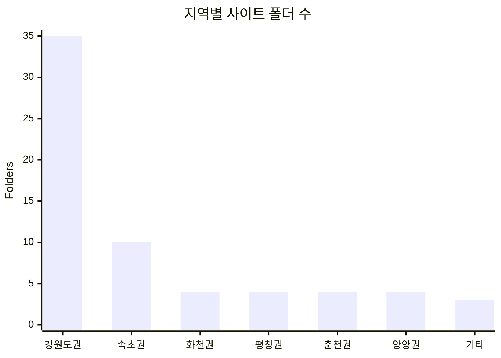
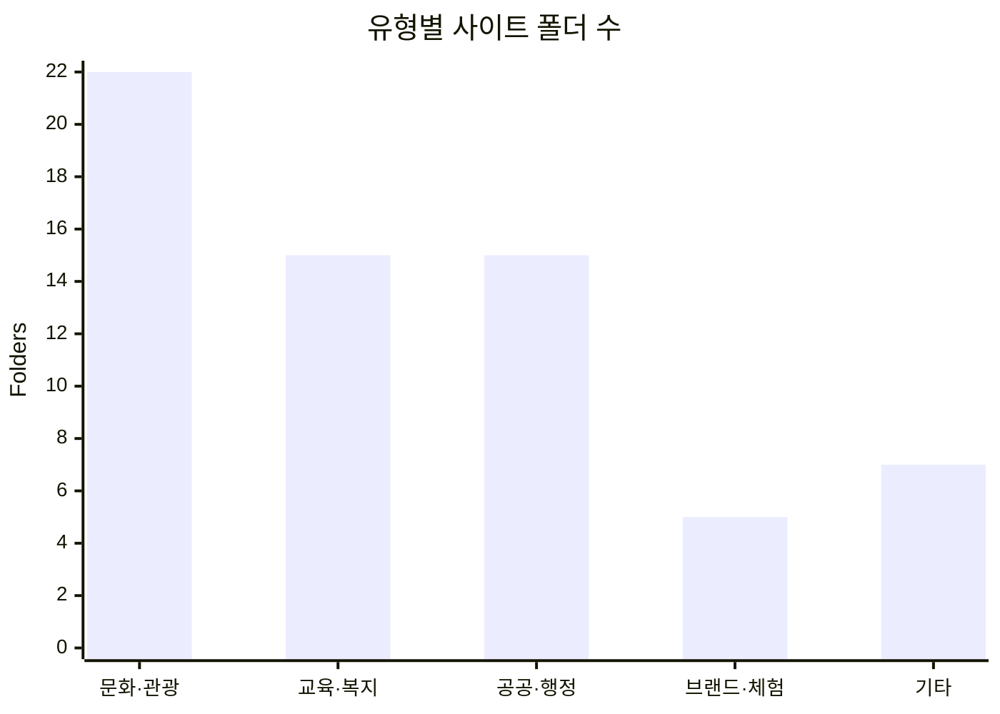

# DQ UI Archive

DQ에서 만든 사이트를 저장소 최상위 폴더 기준으로 묶어 둔 아카이브입니다.

## 기준

- 통계는 저장소의 최상위 사이트 폴더 64개를 기준으로 계산했습니다.
- 사이트 분류는 폴더명 기준입니다.
- 메인 화면과 README의 숫자를 같은 값으로 맞췄습니다.

## 지역별 통계

| 분류 | 개수 |
| --- | ---: |
| 강원도권 | 35 |
| 속초권 | 10 |
| 화천권 | 4 |
| 평창권 | 4 |
| 춘천권 | 4 |
| 양양권 | 4 |
| 기타 | 3 |

## 유형별 통계

| 분류 | 개수 |
| --- | ---: |
| 문화·관광 | 22 |
| 교육·복지 | 15 |
| 공공·행정 | 15 |
| 브랜드·체험 | 5 |
| 기타 | 7 |

## 화면 구성

- 메인 화면에는 지역별·유형별 통계 그래프가 먼저 나옵니다
- 각 사이트는 카드와 썸네일로 열립니다
- 문의는 메일 작성창으로 바로 연결됩니다
