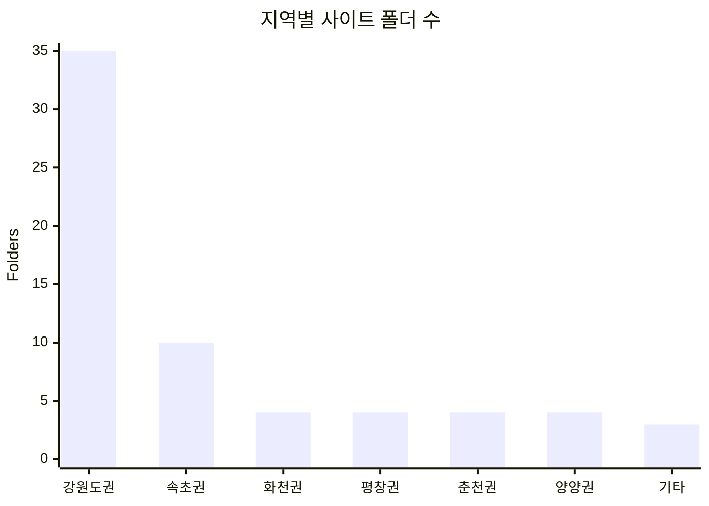
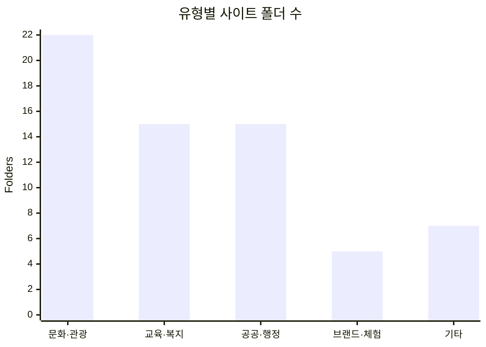

# DQ UI Archive

DQ에서 만든 사이트를 저장소 최상위 폴더 기준으로 묶어 둔 아카이브입니다.

## 기준

- 통계는 저장소의 최상위 사이트 폴더 64개를 기준으로 계산했습니다.
- 사이트 분류는 폴더명 기준입니다.
- 메인 화면과 README의 숫자를 같은 값으로 맞췄습니다.

## 지역별 통계

| 분류 | 개수 |
| --- | ---: |
| 강원도권 | 35 |
| 속초권 | 10 |
| 화천권 | 4 |
| 평창권 | 4 |
| 춘천권 | 4 |
| 양양권 | 4 |
| 기타 | 3 |

## 유형별 통계

| 분류 | 개수 |
| --- | ---: |
| 문화·관광 | 22 |
| 교육·복지 | 15 |
| 공공·행정 | 15 |
| 브랜드·체험 | 5 |
| 기타 | 7 |

## 화면 구성

- 메인 화면에는 지역별·유형별 통계 그래프가 먼저 나옵니다
- 각 사이트는 카드와 썸네일로 열립니다
- 문의는 메일 작성창으로 바로 연결됩니다

## 직접 보기

DQ React Project 사이트 목록 펼치기

### 2026
<ul>
  <li><a href="healing/" target="_blank">평창치유의숲</a></li>
  <li><a href="healing/index_wood.html" target="_blank">목재체험장</a></li>
  <li><a href="cccf/index-city-art.html" target="_blank">춘천시립예술단</a></li>
  <li><a href="cccf/index-dream-art.html" target="_blank">꿈꾸는예술터</a></li>
  <li><a href="cccf/moabom.html" target="_blank">춘천모아봄</a></li>
  <li><a href="cccf" target="_blank">춘천문화재단</a></li>
  <li><a href="kpfis2026" target="_blank">재정정보원</a></li>
  <li><a href="rise" target="_blank">강대라이즈</a></li>
  <li><a href="dq/" target="_blank">DQ 홈페이지</a></li>
</ul>

### ~2025
<ul>
  <li><a href="haksa2025" target="_blank">강원학사</a></li>
  <li><a href="injae2025" target="_blank">강원인재원</a></li>
  <li><a href="pc-edu/" target="_blank">평창평생학습관</a></li>
  <li><a href="hc-tour/" target="_blank">화천관광</a></li>
  <li><a href="golf/" target="_blank">화천파크골프</a></li>
  <li><a href="gwu/indexNew.html" target="_blank">강원도립대신규</a></li>
  <li><a href="gwu" target="_blank">강원도립대</a></li>
  <li><a href="enter" target="_blank">강원도립대입학처</a></li>
  <li><a href="childcare" target="_blank">양양육아지원센터</a></li>
  <li><a href="worknew" target="_blank">강원 워케이션 2024</a></li>
  <li><a href="drd/intro.html" target="_blank">도립대샘플</a></li>
  <li><a href="sokchooffice/index_holic.html" target="_blank">속초홀릭</a></li>
  <li><a href="sokchodata" target="_blank">속초스마트데이터</a></li>
  <li><a href="sokchoportal" target="_blank">속초행정</a></li>
  <li><a href="sokchomayor" target="_blank">속초시장실</a></li>
  <li><a href="sokchooffice" target="_blank">속초사업소</a></li>
  <li><a href="sokchoevent" target="_blank">속초행정 행사포털</a></li>
  <li><a href="sokchochannel" target="_blank">속초행정 속초채널</a></li>
  <li><a href="sokchotour" target="_blank">속초관광</a></li>
  <li><a href="sokchoarthall" target="_blank">속초예술회관</a></li>
  <li><a href="sokchomuseum" target="_blank">속초박물관</a></li>
  <li><a href="efez" target="_blank">동해안권경제자유구역청</a></li>
  <li><a href="heritage" target="_blank">평창유산재단</a></li>
  <li><a href="isc" target="_blank">강원정보보호센터</a></li>
  <li><a href="soldier" target="_blank">제대군인지원센터</a></li>
  <li><a href="youth" target="_blank">디딤돌2배</a></li>
  <li><a href="gwcpn" target="_blank">강원물가정보망</a></li>
  <li><a href="eatof" target="_blank">이토프</a></li>
  <li><a href="contract" target="_blank">강원도 세입세출</a></li>
  <li><a href="worcation" target="_blank">강원워케이션</a></li>
  <li><a href="gwd" target="_blank">강원댁</a></li>
  <li><a href="comz-field" target="_blank">커먼즈필드</a></li>
  <li><a href="gwtour2022" target="_blank">강원관광2022</a></li>
  <li><a href="gwtour-foreign" target="_blank">강원관광2022 - 외국어</a></li>
  <li><a href="gwprovin" target="_blank">강원도청2022</a></li>
  <li><a href="gw-subsite" target="_blank">강원도청-부속사이트</a></li>
  <li><a href="greencity" target="_blank">스마트그린도시-포탈</a></li>
  <li><a href="gwair" target="_blank">스마트그린에어</a></li>
  <li><a href="idq2022/index_list.html" target="_blank">디큐 홈페이지</a></li>
  <li><a href="untan/index_list.html" target="_blank">운탄고도길</a></li>
  <li><a href="sports/index_list.html" target="_blank">고성 강원도민체전</a></li>
  <li><a href="dmz/index_list.html" target="_blank">dmz 박물관</a></li>
  <li><a href="work/index_list.html" target="_blank">dmz 박물관 키오스크 (해상도 : 3840 x 2160)</a></li>
  <li><a href="ecology/index_list.html" target="_blank">생물권보전지역</a></li>
  <li><a href="geopark/index_list.html" target="_blank">강원평화지역 지질공원</a></li>
  <li><a href="gwjob/index_list.html" target="_blank">강원일자리 정보망</a></li>
  <li><a href="foundation/index_list.html" target="_blank">강원도 일자리재단</a></li>
  <li><a href="eroom/index_list.html" target="_blank">강원도 평생교육정보망</a></li>
  <li><a href="gangwonedu/index_list.html" target="_blank">강원도 인재개발원</a></li>
  <li><a href="tour/index_list.html" target="_blank">태백관광</a></li>
  <li><a href="museum/index_list.html" target="_blank">태백고생대 박물관</a></li>
  <li><a href="urban/index_list.html" target="_blank">평창도시경관</a></li>
  <li><a href="gwtour/index_list.html" target="_blank">강원관광</a></li>
  <li><a href="job/index_list.html" target="_blank">강원형 일자리 안심공제</a></li>
  <li><a href="new_mayor/index_list.html" target="_blank">양양군수실</a></li>
  <li><a href="sokchofestival/index_list.html" target="_blank">속초축제</a></li>
  <li><a href="culture/index_list.html" target="_blank">강원문화유산 아카이브</a></li>
  <li><a href="mayor2022/index_list.html" target="_blank">양양군수실2022</a></li>
  <li><a href="governor/index_list.html" target="_blank">강원도지사실2022</a></li>
</ul>

